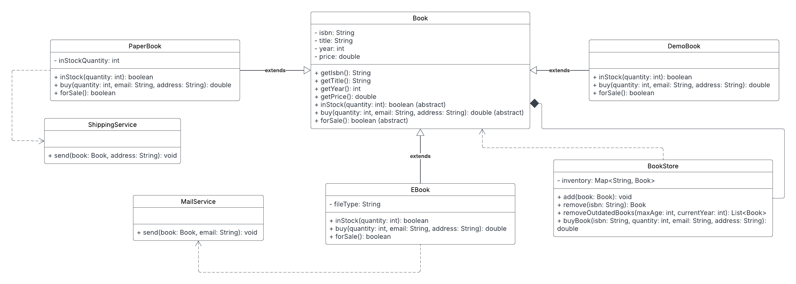
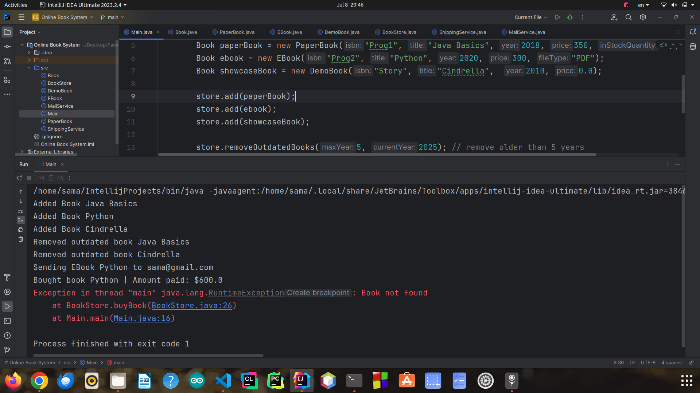

# 📚 Quantum Book Store – Java Implementation

This project implements an **extensible online bookstore system** in Java that handles various types of books (`PaperBook`, `EBook`, `DemoBook`), supports inventory management, and processes customer purchases.

---

## 📐 UML Diagram

---

## 🧱 System Overview

### 1. `Book` (abstract class)
- **Purpose**: Base class for all books. Encapsulates shared attributes like `isbn`, `title`, `year`, and `price`.
- **Why `abstract`**: Prevents direct instantiation. Only specific types of books (e.g., `PaperBook`, `EBook`, `DemoBook`) can be created.
- **Access Modifiers**:
  - `protected` for fields so subclasses can access them.
  - `public` for methods to expose book properties.
- **Key Methods**:
  - `inStock(quantity)`: Checks availability.
  - `buy(quantity, email, address)`: Handles purchase logic.
  - `forSale()`: Indicates whether the book is purchasable.

---

### 2. `PaperBook` (extends `Book`)
- **Purpose**: Represents a physical book with limited stock that can be shipped.
- **Fields**:
  - `inStockQuantity`: Number of copies available.
- **Methods**:
  - Overrides `inStock()`, `buy()`, and `forSale()`.
- **Uses**:
  - `ShippingService.send()`: Sends the book to the customer.

---

### 3. `EBook` (extends `Book`)
- **Purpose**: Represents a digital book that can be emailed.
- **Fields**:
  - `fileType`: e.g., PDF, EPUB.
- **Methods**:
  - Always in stock (unlimited).
  - Sends the book via email.
- **Uses**:
  - `MailService.send()`: Sends the file to the customer’s email.

---

### 4. `DemoBook` (extends `Book`)
- **Purpose**: Represents a showcase or sample book that is **not for sale**.
- **Methods**:
  - `inStock()` always returns false.
  - `buy()` throws an error.
  - `forSale()` returns false.

---

### 5. `BookStore`
- **Purpose**: Manages the inventory of all books.
- **Fields**:
  - `inventory`: A `Map` from ISBN to `Book`.
- **Methods**:
  - `add(Book)`: Adds a book to inventory.
  - `remove(String)`: Removes a book by ISBN.
  - `removeOutdatedBooks(maxAge, year)`: Removes old books.
  - `buyBook(isbn, qty, email, address)`: Handles complete purchase logic.
- **Relationships**:
  - `◆` Composition: Owns many `Book` objects.
  - `▷` Uses `Book` methods like `inStock`, `buy`, `forSale`.

---

### 6. `ShippingService`
- **Purpose**: Utility class to ship paper books.
- **Method**:
  - `static send(Book, address)`: Simulates shipping.
- **Why `static`**: No object state; acts as a helper.

---

### 7. `MailService`
- **Purpose**: Utility class to email eBooks.
- **Method**:
  - `static send(Book, email)`: Simulates email sending.
- **Why `static`**: Same reason as above.

---

## 🧪 Test 

---

# 🛒 E-Commerce System – Java Implementation

This project implements a simplified e-commerce system in Java that supports products (some expirable, some shippable), customer checkout with cart functionality, and shipping management.

---

## 📐 UML Diagram

---

## 🧱 System Overview

### 1. `Product` (abstract class)
- **Purpose**: Base class for all products. Provides common fields and behaviors such as `name`, `price`, `quantity`, and basic utility methods.
- **Why `abstract`**: So it can't be instantiated directly—only specific product types like `ExpiredProduct` and `ShippableProduct` can be created.
- **Access Modifiers**:
  - `protected` for fields so they are accessible in subclasses.
  - `public` for methods to expose basic product functionality.
  
---

### 2. `ShippedSpecs` (interface)
- **Purpose**: Defines a contract for any object that needs to be shipped.
- **Why interface**: Allows different product types (e.g. `ShippableProduct`) to be handled uniformly by the `ShippingService`.
- **Methods**:
  - `getName()`, `getWeight()`, `getRequestedQuantity()`

---

### 3. `ExpiredProduct` (extends `Product`)
- **Purpose**: Represents a product that can expire (e.g. food).
- **Fields**:
  - `expiredDate`: parsed from a string into `LocalDate`.
- **Method override**:
  - `isExpired()`: checks if the product is outdated based on today's date.

---

### 4. `ShippableProduct` (extends `Product`, implements `ShippedSpecs`)
- **Purpose**: Represents products that must be shipped (e.g. TVs, cheese).
- **Fields**:
  - `weight`: for shipping cost calculation.
  - `requestedQuantity`: needed by the shipping service.
- **Methods**:
  - Overrides `isShippable()`, `getWeight()`, `getRequestedQuantity()` from the interface.
- **Why use `implements`**: Allows passing these objects into `ShippingService`.

---

### 5. `CartItem`
- **Purpose**: Associates a product with a specific quantity in the cart.
- **Fields**:
  - `product`: of type `Product`.
  - `quantity`: selected by the user.

---

### 6. `Cart`
- **Purpose**: Holds all items the customer wants to purchase.
- **Methods**:
  - `add(Product, qty)`: Validates stock and tracks shippable quantities.
  - `isEmpty()`, `clear()`
- **Why no access modifier**: Package-private is fine here as it's only used within this project.

---

### 7. `Customer`
- **Purpose**: Represents a customer with a name and a balance.
- **Methods**:
  - `checkBalance(amount)`: Validates and deducts balance at checkout.
- **Access**:
  - Class and constructor are `public` for general use.

---

### 8. `ShippingService`
- **Purpose**: A utility class that handles the shipping logic.
- **Method**:
  - `static ship(List<ShippedSpecs>)`: Prints shipment notice and calculates total weight.
- **Why `static` method**: No need to create an object of this class; it acts like a helper service.

---

### 9. `Checkout`
- **Purpose**: Coordinates the entire checkout process.
- **Method**:
  - `static checkout(Customer, Cart)`: Handles validation, calculates totals, reduces inventory, and prints receipt.
- **Why `static`**: Like `ShippingService`, it doesn’t require internal state.

---

