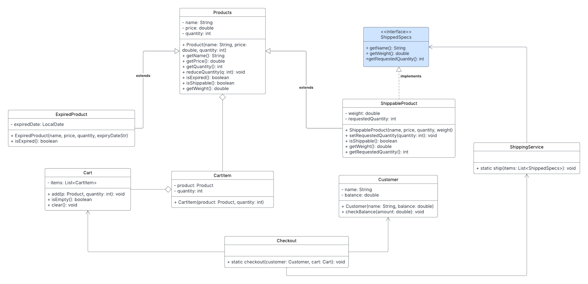

# 🛒 E-Commerce System – Java Implementation

This project implements a simplified e-commerce system in Java that supports products (some expirable, some shippable), customer checkout with cart functionality, and shipping management.

---

## 📐 UML Diagram

---

## 🧱 System Overview

### 1. `Product` (abstract class)
- **Purpose**: Base class for all products. Provides common fields and behaviors such as `name`, `price`, `quantity`, and basic utility methods.
- **Why `abstract`**: So it can't be instantiated directly—only specific product types like `ExpiredProduct` and `ShippableProduct` can be created.
- **Access Modifiers**:
  - `protected` for fields so they are accessible in subclasses.
  - `public` for methods to expose basic product functionality.
  
---

### 2. `ShippedSpecs` (interface)
- **Purpose**: Defines a contract for any object that needs to be shipped.
- **Why interface**: Allows different product types (e.g. `ShippableProduct`) to be handled uniformly by the `ShippingService`.
- **Methods**:
  - `getName()`, `getWeight()`, `getRequestedQuantity()`

---

### 3. `ExpiredProduct` (extends `Product`)
- **Purpose**: Represents a product that can expire (e.g. food).
- **Fields**:
  - `expiredDate`: parsed from a string into `LocalDate`.
- **Method override**:
  - `isExpired()`: checks if the product is outdated based on today's date.

---

### 4. `ShippableProduct` (extends `Product`, implements `ShippedSpecs`)
- **Purpose**: Represents products that must be shipped (e.g. TVs, cheese).
- **Fields**:
  - `weight`: for shipping cost calculation.
  - `requestedQuantity`: needed by the shipping service.
- **Methods**:
  - Overrides `isShippable()`, `getWeight()`, `getRequestedQuantity()` from the interface.
- **Why use `implements`**: Allows passing these objects into `ShippingService`.

---

### 5. `CartItem`
- **Purpose**: Associates a product with a specific quantity in the cart.
- **Fields**:
  - `product`: of type `Product`.
  - `quantity`: selected by the user.

---

### 6. `Cart`
- **Purpose**: Holds all items the customer wants to purchase.
- **Methods**:
  - `add(Product, qty)`: Validates stock and tracks shippable quantities.
  - `isEmpty()`, `clear()`
- **Why no access modifier**: Package-private is fine here as it's only used within this project.

---

### 7. `Customer`
- **Purpose**: Represents a customer with a name and a balance.
- **Methods**:
  - `checkBalance(amount)`: Validates and deducts balance at checkout.
- **Access**:
  - Class and constructor are `public` for general use.

---

### 8. `ShippingService`
- **Purpose**: A utility class that handles the shipping logic.
- **Method**:
  - `static ship(List<ShippedSpecs>)`: Prints shipment notice and calculates total weight.
- **Why `static` method**: No need to create an object of this class; it acts like a helper service.

---

### 9. `Checkout`
- **Purpose**: Coordinates the entire checkout process.
- **Method**:
  - `static checkout(Customer, Cart)`: Handles validation, calculates totals, reduces inventory, and prints receipt.
- **Why `static`**: Like `ShippingService`, it doesn’t require internal state.

---

